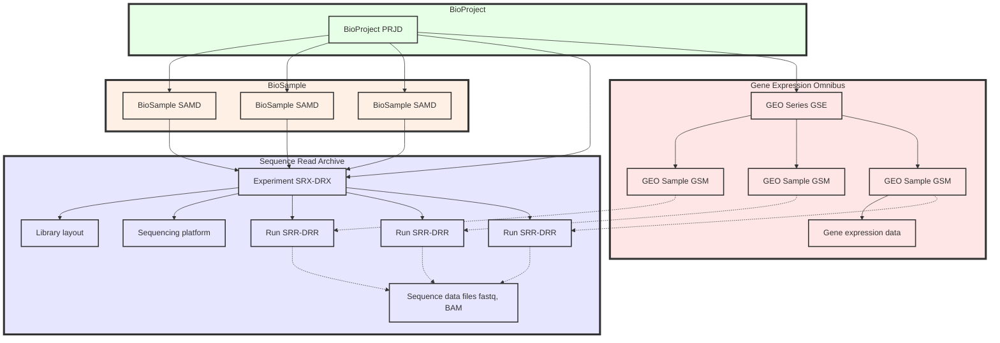

> ##### Aim for this page
> Know what kind of databases in expression analysis are available
{: .block-tip }

## Quick answer of this page: Raw=SRA, Processed=GEO

I want you to recoginie two important databases, SRA and GEO. Typical differences of the 2 databases:

| Aspect | SRA (Sequence Read Archive) | GEO (Gene Expression Omnibus) |
|--------|-----------------------------|-----------------------------|
| Purpose | Raw sequence data repository | Functional genomics data repository |
| Data type | Raw sequencing data (fastq, bam) | Processed data, metadata, and raw data links |
| Scope | All sequencing platforms and applications | Primarily gene expression data, but includes other functional genomics data |
| Data size | Typically larger files (raw data) | Usually smaller files (processed data) |
| Search capability | Sequence-based searches | Expression and metadata-based searches |

SRA description: [https://www.ncbi.nlm.nih.gov/sra/docs/](https://www.ncbi.nlm.nih.gov/sra/docs/)

GEO description: [https://www.ncbi.nlm.nih.gov/geo/info/overview.html](https://www.ncbi.nlm.nih.gov/geo/info/overview.html)

### Databases are linked to each other

[GSE275240](https://www.ncbi.nlm.nih.gov/geo/query/acc.cgi?acc=GSE275240) is our lab's previous paper's data accession ID. This GSE275240 is connected to another database called BioProject under [PRJDB15620](https://www.ncbi.nlm.nih.gov/bioproject/PRJDB15620). BioProject contains SRA Run as sequence data and BioSample to explain what each sequence data is derived from. Certainly. SRA 'Experiment' describes the sequencing library derived from a specific sample and the sequencing method used. Much of the publicly available information about the data is recorded in the Experiment. SRA 'Run' is an object that groups together data files that should be linked to an Experiment. It contains little descriptive information about the data itself. All data files listed in a Run are merged into an SRA file for archiving (and into fastq files for distribution).

### Database structure

This is an overall structure of SRA/BioSample/BioProject. The picture below is cited from [DDBJ](https://www.ddbj.nig.ac.jp/biosample/overview.html).

Since it does not contain GEO, I just added in a mermaid plot. BioProject is a database designed to organize research projects and their associated data. By citing the BioProject accession number, data can be grouped on a project-by-project basis. BioSample and GEO Sample (GSM) ultimately explains the identical information. 

> ##### DRA/SRA differences?
> DRA (DDBJ Sequence Read Archive) is an archive of raw read sequences and maintained by DDBJ. 
> DRA (DDBJ Sequence Read Archive) is a member of the International Nucleotide Sequence Database Collaboration (INSDC) and is operated in international cooperation with NCBI SRA and EBI Sequence Read Archive (ERA). The data is mirrored (synchronized). If you can find the same dataset in SRA and DRA, downloading from DRA is geographically much faster.
{: .block-tip }